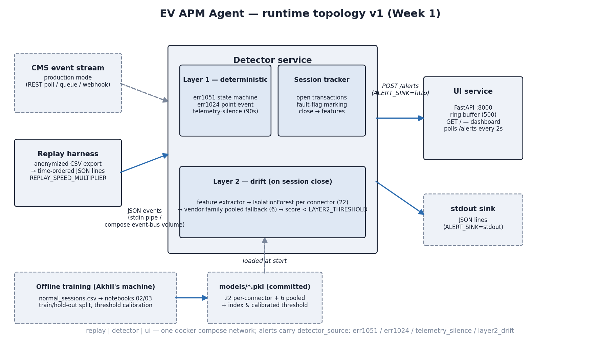

# EV APM Agent

A watchful operator for EV charging stations that catches faults the instant they happen and spots chargers starting to go bad before they fully fail.

It plugs into the data the charging network already sends to its management system — no new sensors, no hardware changes.

It does two things: a fast rules-based catcher for known fault patterns, and a learning layer that tracks each connector's "normal" over time to flag drift.

It also sorts alerts — separating noisy self-recovering blips from real problems that need a technician — so operators stop drowning in noise.

We'll prove it on real data from 39 stations across 5+ vendors, deployed as a drop-in container next to an existing charging management system.

## What this is (and isn't)

- **What it is:** Real-time fault detection and per-connector degradation tracking across an EV charging fleet.
- **What it isn't:** Not a battery health diagnostic — it analyzes charging-station telemetry to flag faults and connector-level degradation, vendor-agnostic.
- **Where it lives:** Deploys as a sidecar container next to an operator's existing CMS, scaling per fleet size.

## Team

| Name | Role |
|------|------|
| Abhishek | Layer 1 + integration |
| Akhil | Layer 2 + data audit |

## Project Structure

| Folder | Purpose |
|--------|---------|
| `data/` | Raw and processed datasets (gitignored — never committed); committed `sql/` export queries and `reference/` inventory CSVs |
| `detector/` | Detection service — `layer1.py` (rules-based fault catcher), `layer2.py` (drift detection and learning layer) |
| `replay/` | Historical replay and simulation tools |
| `models/` | Trained Layer 2 model artifacts |
| `ui/` | Operator dashboard and alert interface |
| `notebooks/` | Exploration, EDA, and prototyping |
| `docs/` | Architecture, methodology, and runbooks |
| `tests/` | Unit and integration tests |

## Architecture



Two-layer detection: **Layer 1** — deterministic fault-sequence state
machines (err1051), point-event category detectors (err1024, WeakSignal,
GroundFailure, Under/OverVoltage) and a telemetry-silence detector, fed
through a vendor-code normalizer; **Layer 2** — per-connector Isolation
Forests (pooled fallback for sparse connectors) scoring every closed
session. An alert prioritizer tiers everything (P1/P2/P3) with the deciding
signal attached before it reaches the dashboard.

## Quickstart

```bash
docker compose up            # replay -> detector -> ui on localhost:8000
```

Demo replay of the synthetic fault fixtures at 60x:

```bash
docker compose down -v
MSYS_NO_PATHCONV=1 DATA_DIR=/app/tests/fixtures/day5_replay \
  REPLAY_SPEED_MULTIPLIER=60 docker compose up
# browser -> http://localhost:8000  (P1/P2/P3 feed + drift panel)
```

Local pipeline without Docker:

```bash
REPLAY_SPEED_MULTIPLIER=0 python replay/main.py | python detector/main.py
python -m pytest tests/    # 57 tests
```

Headline metric: **3.62% false-positive rate** on a chronological held-out
split (notebook 04); alert thresholds documented in `.env.example`.

## Attribution

Built for the **ET AI Hackathon 2026** by V. Abhishek Prakash (Layer 1 +
integration) and Akhil Prasad (Layer 2 + data audit).

Data provenance: anonymized OCPP telemetry exports from a production
charging-management system (charge-box ids SHA-256-hashed, geo coordinates
rounded, customer/RFID/IP fields dropped at export). Raw exports are never
committed — see `.gitignore` and `docs/data_audit_v0.md` for the audit trail.
MIT licensed.
